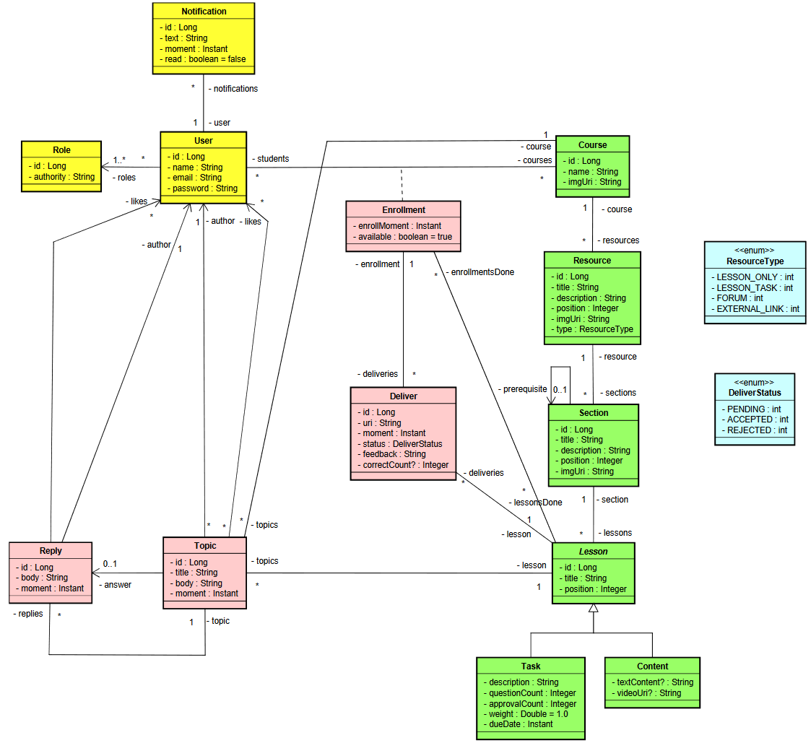

# School Management System

[](https://opensource.org/licenses/MIT)

The School Management System is a comprehensive web application developed in Spring Boot to efficiently manage various aspects of a school. It provides functionalities for student and teacher management, course administration, grade management, and more.

## Table of Contents

- [Features](#features)
- [Conceptual Model](#conceptual-model)
- [Installation](#installation)
- [Usage](#usage)
- [Technologies Used](#technologies-used)
- [Contributing](#contributing)
- [License](#license)

## Features

- User authentication and role-based access control (Admin, Instructor, Student)
- Student management: Add, view, update, and delete student records with comprehensive details
- Teacher management: Maintain teacher profiles with qualifications and contact information
- Course management: Create, assign teachers, and manage course schedules
- Grade management: Record and calculate student grades for assessments and exams
- Communication: Internal notification system for administrators, teachers, and students
- Reporting and analytics: Generate reports on grades, and more

## Conceptual Model



## Installation

1. Clone the repository:

   ```bash
   git clone https://github.com/demoraisnight/SpringBootProj1.git
   ...
   ...
   ...
   
## Usage
- Register as an admin user with full access rights.
- Use the admin account to create teacher and student accounts.
- Assign teachers to courses and schedule classes.
- Manage students grades.
- Explore other features based on your specific requirements.
## Technologies Used
- Spring Boot
- Spring Security
- Spring Data JPA
- Spring Validations
- Docker
- Postgres
- ModelMapper

## Contributing
Contributions are welcome! If you find any issues or have suggestions for improvements, please feel free to open an issue or create a pull request. Make sure to follow the existing coding style and commit message conventions.

## License
This project is licensed under the MIT License. See the LICENSE file for details.